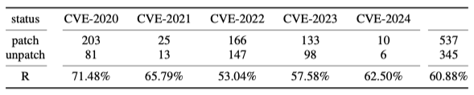
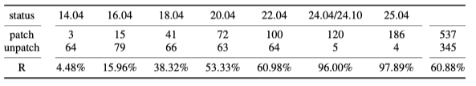
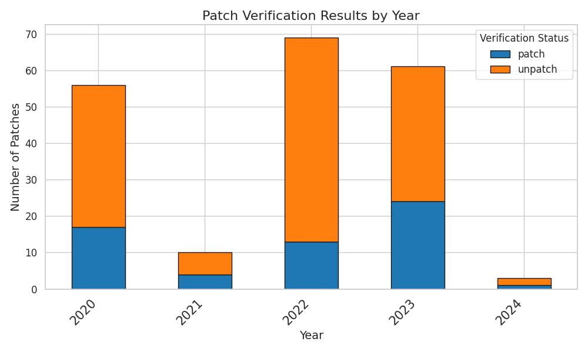

# APTShield Dataset

This repository contains data and visualizations related to vulnerability detection and patch verification across Ubuntu versions. Here is an overview of the available files and their purposes.

## Files Overview

### Data Files
1. **[`patch-status-UPR.json`](./patch-status-UPR.json)**
   - **Description**: This file contains a comprehensive list of CVEs in Ubuntu packages, detailing their patch status as patched, unpatched, or not vulnerable.
   - **Usage**: This file has been manually validated and can be used to analyze the effectiveness of different vulnerability detection tools.

2. **[`comparison_of_cve_detection_across_tools.csv`](./comparison_of_cve_detection_across_tools.csv)**
   - **Description**: A comparison of the results from various CVE detection tools.
   - **Usage**: This table is used to compare different vulnerability detection tools.

---

### Figures and Visualizations
1. **CVE Patch Status by Year**
   - **File**: [`cves_patch_status_by_year.png`](./cves_patch_status_by_year.png)
   - **Description**: This figure displays the exact number of CVEs reported each year and highlights the percentage of patched vulnerabilities.
   - **Significance**: Provides an overview of annual trends in vulnerability patching.
   - **Visualization**:
     

2. **Patch Status by Ubuntu Version**
   - **File**: [`patch_status_by_ubuntu_version.png`](./patch_status_by_ubuntu_version.png)
   - **Description**: This figure shows the exact number of vulnerabilities in each Ubuntu version and the percentage of patched vulnerabilities.
   - **Significance**: Helps analyze the patching performance across different Ubuntu versions.
   - **Visualization**:
     

3. **Patch Verification Results by Ubuntu LTS Version**
   - **File**: [`patch_verification_results_by_version.png`](./patch_verification_results_by_version.png)
   - **Description**: A stacked bar chart illustrating the distribution of patched (`patch`) and unpatched (`unpatch`) vulnerabilities across various Ubuntu LTS versions.
   - **Significance**: Useful for understanding trends in patching across long-term support (LTS) releases.
   - **Visualization**:
     

4. **Patch Verification Results by Year**
   - **File**: [`patch_verification_results_by_year.png`](./patch_verification_results_by_year.png)
   - **Description**: A stacked bar chart presenting the number of patched (`patch`) and unpatched (`unpatch`) vulnerabilities for each year.
   - **Significance**: Highlights the progress of patching vulnerabilities over the years.
   - **Visualization**:
     

---

### Fuzzle Experimental Evaluation

This section evaluates the fuzzing performance of APTShield in comparison to AFLGo and AFL++ using the [Fuzzle dataset](https://github.com/SoftSec-KAIST/Fuzzle).&#x20;

1. **[`fuzzle_summary_generator`](./fuzzle_summary_generator)**

   - **Description**: Documents experimental outcomes for different generator configurations.
   - **Results**: APTShield demonstrated a 100% bug detection rate for several CVEs (CVE-2016-4487, CVE-2016-4489, CVE-2016-4492, CVE-2016-4493), with competitive TTE ranging from 0.13 hours (default) to 0.99 hours (CVE-2016-4491).

   **Detailed Results:**

   *Bug Detection Rate (%)*
   | Tool      | CVE-2016-4487 | CVE-2016-4489 | CVE-2016-4491 | CVE-2016-4492 | CVE-2016-4493 | CVE-2016-6131 | default |
   |-----------|---------------|---------------|---------------|---------------|---------------|---------------|----------|
   | aflgo     | 0             | 0             | 0             | 67            | 0             | 0             | 79       |
   | aflpp     | 67            | 100           | 0             | 100           | 100           | 0             | 92       |
   | aptshield | 100           | 100           | 33            | 100           | 100           | 33            | 100      |

   *Time To Exploit (hours)*
   | Tool      | CVE-2016-4487 | CVE-2016-4489 | CVE-2016-4491 | CVE-2016-4492 | CVE-2016-4493 | CVE-2016-6131 | default |
   |-----------|---------------|---------------|---------------|---------------|---------------|---------------|----------|
   | aflgo     | -             | -             | -             | 0.71          | -             | -             | 0.32     |
   | aflpp     | 0.30          | 0.18          | -             | 0.12          | 0.14          | -             | 0.10     |
   | aptshield | 0.30          | 0.18          | 0.99          | 0.21          | 0.29          | 0.77          | 0.13     |

2. **[`fuzzle_summary_size`](./fuzzle_summary_size)**

   - **Description**: Evaluates performance on mazes of varying dimensions (ranging from 10x10 to 40x40).
   - **Results**: APTShield achieved 100% bug detection rate in 10x10, 20x20, and 40x40 mazes, while achieving 81% in 30x30 mazes. The TTE remained efficient across all sizes (0.01h to 0.39h). It is noteworthy that AFLGo's performance declined sharply, achieving a 0% success rate on 40x40 mazes.

   **Detailed Results:**

   *Bug Detection Rate (%)*
   | Tool      | 10x10 | 20x20 | 30x30 | 40x40 |
   |-----------|--------|--------|--------|--------|
   | aflgo     | 100    | 90     | 14     | 0      |
   | aflpp     | 100    | 90     | 67     | 100    |
   | aptshield | 100    | 100    | 81     | 100    |

   *Time To Exploit (hours)*
   | Tool      | 10x10 | 20x20 | 30x30 | 40x40 |
   |-----------|--------|--------|--------|--------|
   | aflgo     | 0.01   | 0.33   | 0.74   | -      |
   | aflpp     | 0.01   | 0.05   | 0.22   | 0.39   |
   | aptshield | 0.01   | 0.07   | 0.39   | 0.33   |

3. **[`fuzzle_summary_cycle`](./fuzzle_summary_cycle)**

   - **Description**: Analyzes performance on mazes characterized by differing cycle.
   - **Results**: APTShield maintained consistent bug detection rates (100% at 0%, 50%, and 100% cycle; 92% at 25%) with TTE ranging from 0.04h to 0.21h. This surpassed both AFLGo (50% detection at 25% cycle) and AFL++ (79% detection at 25% cycle).

   **Detailed Results:**

   *Bug Detection Rate (%)*
   | Tool      | 0    | 25   | 50   | 100  |
   |-----------|------|------|------|------|
   | aflgo     | 100  | 50   | 100  | 100  |
   | aflpp     | 100  | 79   | 100  | 100  |
   | aptshield | 100  | 92   | 100  | 100  |

   *Time To Exploit (hours)*
   | Tool      | 0    | 25   | 50   | 100  |
   |-----------|------|------|------|------|
   | aflgo     | 0.24 | 0.34 | 0.51 | 0.30 |
   | aflpp     | 0.03 | 0.14 | 0.08 | 0.02 |
   | aptshield | 0.04 | 0.21 | 0.09 | 0.10 |

4. **[`fuzzle_summary_algorithm`](./fuzzle_summary_algorithm)**

   - **Description**: Analyzes performance on mazes characterized by differing algorithms.
   - **Results**: APTShield was the only tool achieving 100% bug detection in Backtracking algorithm (with 0.02h TTE), while both AFLGo and AFL++ failed completely. It also maintained 100% detection in Kruskal, Prims, and Sidewinder, and 91% in Wilsons, with TTE ranging from 0.02h to 0.22h across all algorithms.

   **Detailed Results:**

   *Bug Detection Rate (%)*
   | Tool      | Backtracking | Kruskal | Prims | Sidewinder | Wilsons |
   |-----------|--------------|---------|--------|------------|---------|
   | aflgo     | 0            | 100     | 100    | 100        | 53      |
   | aflpp     | 0            | 100     | 100    | 100        | 84      |
   | aptshield | 100          | 100     | 100    | 100        | 91      |

   *Time To Exploit (hours)*
   | Tool      | Backtracking | Kruskal | Prims | Sidewinder | Wilsons |
   |-----------|--------------|---------|--------|------------|---------|
   | aflgo     | -            | 0.27    | 0.35   | 0.20       | 0.37    |
   | aflpp     | -            | 0.10    | 0.05   | 0.03       | 0.14    |
   | aptshield | 0.02         | 0.07    | 0.09   | 0.02       | 0.22    |
