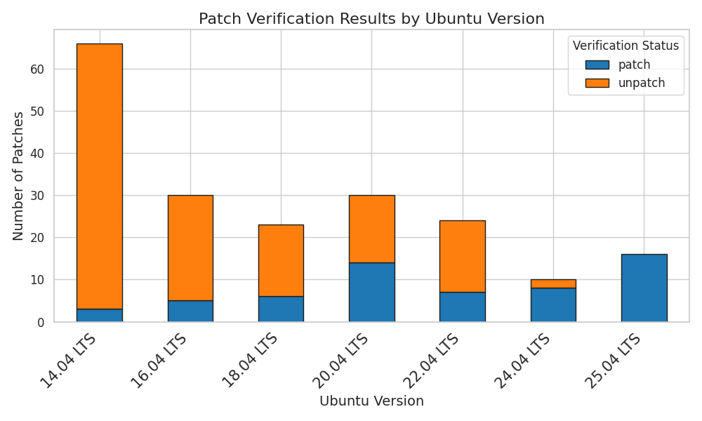

# APTShield Dataset

This repository contains data and visualizations related to vulnerability detection and patch verification across Ubuntu versions. Below is a detailed description of the files and their significance.

## Files Overview

### Data Files
1. **[`patch-status-UPR.json`](./patch-status-UPR.json)**
   - **Description**: It provides a detailed list of the patch status (patch, unpatch, or no_vul) for each CVE in Ubuntu packages.
   - **Usage**: This file has been manually validated and can be used to analyze the effectiveness of different vulnerability detection tools.

2. **[`comparison_of_cve_detection_across_tools.csv`](./comparison_of_cve_detection_across_tools.csv)**
   - **Description**: A comparison of the results from various CVE detection tools.
   - **Usage**: This table is used to compare different vulnerability detection tools.

---

### Figures and Visualizations
1. **CVE Patch Status by Year**
   - **File**: [`cves_patch_status_by_year.png`](./cves_patch_status_by_year.png)
   - **Description**: This figure displays the exact number of CVEs reported each year and highlights the percentage of patched vulnerabilities.
   - **Significance**: Provides an overview of annual trends in vulnerability patching.
   - **Visualization**:
     

2. **Patch Status by Ubuntu Version**
   - **File**: [`patch_status_by_ubuntu_version.png`](./patch_status_by_ubuntu_version.png)
   - **Description**: This figure shows the exact number of vulnerabilities in each Ubuntu version and the percentage of patched vulnerabilities.
   - **Significance**: Helps analyze the patching performance across different Ubuntu versions.
   - **Visualization**:
     

3. **Patch Verification Results by Ubuntu LTS Version**
   - **File**: [`patch_verification_results_by_version.png`](./patch_verification_results_by_version.png)
   - **Description**: A stacked bar chart illustrating the distribution of patched (`patch`) and unpatched (`unpatch`) vulnerabilities across various Ubuntu LTS versions.
   - **Significance**: Useful for understanding trends in patching across long-term support (LTS) releases.
   - **Visualization**:
     

4. **Patch Verification Results by Year**
   - **File**: [`patch_verification_results_by_year.png`](./patch_verification_results_by_year.png)
   - **Description**: A stacked bar chart presenting the number of patched (`patch`) and unpatched (`unpatch`) vulnerabilities for each year.
   - **Significance**: Highlights the progress of patching vulnerabilities over the years.
   - **Visualization**:
     

